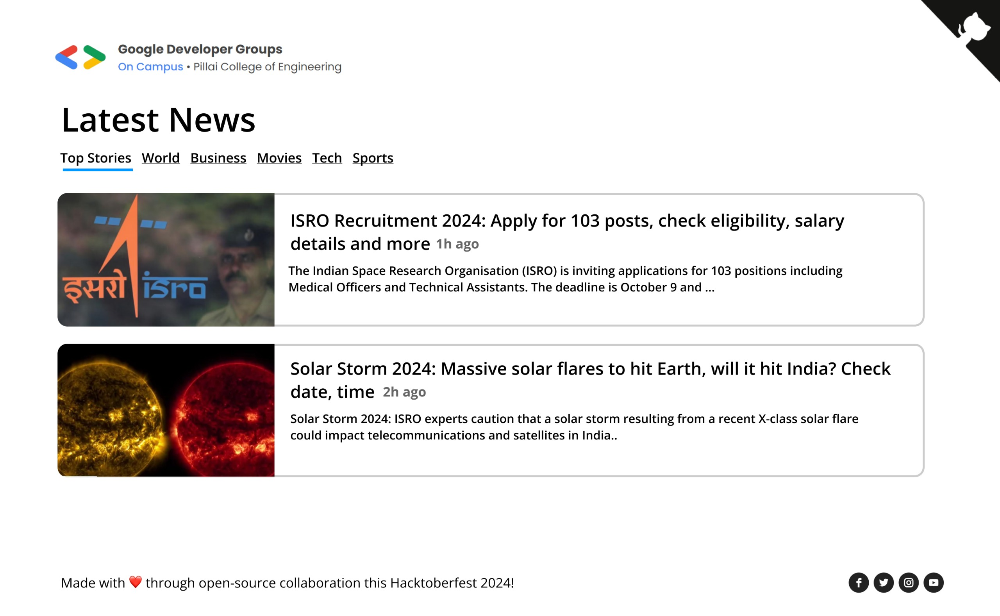

# News App

## Introduction

The **News App** is a web-based tool that allows users to fetch and display the latest news by connecting to a live RSS feed. The app pulls recent headlines from the [NDTV RSS Feed](https://www.ndtv.com/rss) and displays them in an easily readable format for users to browse through.

### How to Contribute

This repository is open to contributions under the Hacktoberfest guidelines. Whether you're fixing bugs, adding new features, or improving the documentation, your contributions are welcome!

Before contributing, please ensure you've read and understood the [contributing guidelines](CONTRIBUTING.md).

#### Steps to Contribute:

1. Fork the repository to your GitHub account.
2. Clone your forked repo.
3. Make your changes and commit them with clear messages.
4. Submit a pull request (PR) for review.
5. Wait for a maintainer to assign you an issue or approve your PR.

### How to Use the News App

1. **Fetch News**: The app automatically pulls the latest news from the [NDTV RSS Feed](https://www.ndtv.com/rss) when you open it.
2. **Browse Headlines**: News headlines are displayed on the page, and you can scroll through them.
3. **View Details**: Clicking on a headline will open the full article in a new tab for more details.

---

### Using `fetch` API to Get News

We are using the `fetch` API to retrieve news from the NDTV RSS feed. This is a simple and efficient way to get data from a remote API and display it in real-time on the app. The fetched data is then parsed and displayed as a list of news articles.

## Project Setup Instructions

1. Clone the repository:

   ```bash
   git clone https://github.com/yourusername/NewsApp.git
   cd NewsApp
   ```

2. Open the `index.html` file in any browser to view the News App.

3. Modify or add your code for fetching, displaying news, and updating UI elements as specified in the comments within `main.js`.

---

## GitHub Corner

This project includes a GitHub corner to easily access the repository. To add the GitHub corner to your project, visit the GitHub Corners website and follow the instructions.

## Folder Structure

```
News App/
├── assets/
│   └── logo.png            # App logo
├── styles/               
│   └── main.css            # Styles for the page
├── index.html              # Main HTML file for the news app
├── scripts/               
│   └── main.js             # JavaScript logic for fetching and displaying news
├── README.md               # Project documentation
└── CONTRIBUTING.md         # Steps to contribute file

```

---

## UI Reference Images

Below are the reference images for the UI of the News App:



---

## Guidelines for Contributors

1. **HTML/CSS/JavaScript Contributions**:

   - Add new features or improve the styling in the `index.html` and `main.css` files.
   - Add logic for fetching and displaying news articles in `main.js`.

2. **Bug Fixes**:
   - Report bugs via the GitHub Issues tab.
   - Fix bugs by submitting a pull request after discussing with maintainers.

---

## Future Enhancements

1. **Category Filters**: Add filters to allow users to browse news by categories like sports, technology, politics, etc.
2. **News Search**: Implement a search feature for users to find specific news articles.
3. **Loading Animations**: Add a loading animation while fetching news to improve the user experience.
4. **Pagination**: Implement pagination for easier navigation through large amounts of news.

---

### Hacktoberfest Participation

Participate in Hacktoberfest by contributing to this project! Make sure the repositories are marked with the Hacktoberfest label. Contributions must be made between October 1st and October 31st to count toward Hacktoberfest.

Happy coding!
